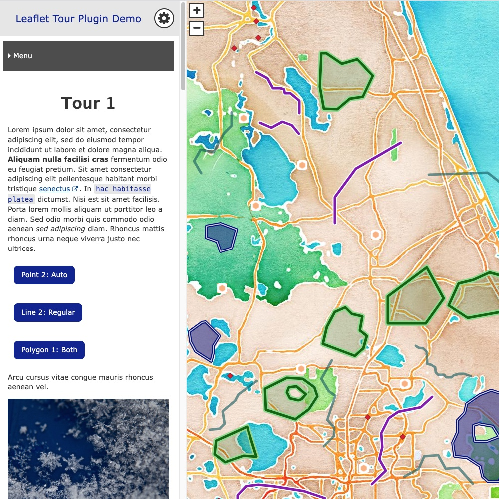

# Leaflet Tour Plugin

**Leaflet Tour** is a plugin for the [Grav](https://learn.getgrav.org) CMS (content management system) designed to help content creators build accessible websites that tell stories with maps. It uses scrollytelling, a narrative format in which scrolling through the content causes changes on the page. In this case, a column of content is provided on one side of the page, and scrolling through the content causes changes in the map on the other side of the page (such as panning the map to a given location).

Note: For small screens/mobile it is impractical to display both the narrative content and map at once, so this is handled differently.

Check out the [demo site](https://leaflet-tour.oucreate.com/plugin-demo) to see how the plugin works in action.

<h2 id="features">Features</h2>

- Create interactive content and maps without working directly with any HTML or JavaScript
- Create websites that are accessible to people with disabilities (instructions for what users need to do to ensure this are included in the [accessibility page of the Leaflet Tour documentation](https://leaflet-tour.oucreate.com/accessibility))
- Lots of customization options
- Add popup content to geographic features, and use provided shortcodes to easily insert buttons for that content within the page
- Customize the map by choosing one of many included tile servers

<h2 id="requirements">Requirements</h2>

- A Grav site running Grav version 1.7.0 or higher
- [Digital Scholarship theme](https://github.com/oulibraries/grav-theme-digital-scholarship) (The theme must be enabled)
- [Admin Panel plugin](https://github.com/getgrav/grav-plugin-admin) - Note: May be installed automatically when you install Grav (for example, if you use Reclaim Hosting)
- [Shortcode Core plugin](https://github.com/getgrav/grav-plugin-shortcode-core)

<h2 id="installation">Installation</h2>

Installing the Leaflet Tour plugin can be done in one of two ways. The [Grav Package Manager (GPM)](https://learn.getgrav.org/cli-console/grav-cli-gpm) installation method enables you to install the plugin with the admin panel or a terminal command, while the manual method enables you to do so via a zip file.

<h3 id="gpm-installation">GPM Installation (Preferred)</h3>

The simplest way to install this plugin is via the admin panel, especially since the admin plugin is a requirement. To install, go to the Plugins tab on your dashboard, click the **Add** button, look up this plugin, and then click **Install**.

Alternatively, you can install this plugin using your system's terminal or command line. From the root of your Grav directory type `bin/gpm install leaflet-tour`. This will install the Leaflet Tour plugin into your `/user/plugins` directory within Grav. Its files will be found under `your-site/grav/user/plugins/leaflet-tour`.

<h3 id="manual-installation">Manual Installation</h3>

To install this plugin manually:

1. Download the zip file from the [plugin repository](https://github.com/oulibraries/grav-plugin-leaflet-tour) or by finding the files on the [GetGrav website](https://getgrav.org/downloads/plugins).
2. Upload the file to `your-site/grav/user/plugins`.
3. Unzip/extract the file.
4. Rename the folder to `leaflet-tour`.

The filepath to the plugin should now be `your-site/grav/user/plugins/leaflet-tour`.

<h2 id="updating">Updating</h2>

Updates to the Leaflet Tour plugin may be published in the future. As with installation, you can update the plugin through the Grav Package Manager (via the admin panel or your system's terminal) or manually.

Please note: Any changes you have made to any of the files in the plugin will be overwritten. Any files located elsewhere (for example, a .yaml settings file placed in `user/config/plugins`) will remain intact. Therefore, it is strongly discouraged to make any changes directly to plugin files.

<h3 id="gpm-update">GPM Update (Preferred)</h3>

The simplest way to update this plugin is via the admin panel. To do this, go to the Plugins tab on your dashboard and check for updates. The dashboard will indicate if any plugins have available updates and will allow you to update them individually or all at once.

Alternatively, you can update this plugin using your system's terminal or command line. From the root of your Grav directory type `bin/gpm update leaflet-tour`. This will check if the Leaflet Tour plugin has any updates. If it does, you will be asked whether or not you wish to update. To continue, type `y` and hit enter.

<h3 id="manual-update">Manual Update</h3>

To update this plugin manually:

1. Delete the `your-site/user/plugins/leaflet-tour` directory.
2. Follow the manual installation directions from this readme.
3. Clear the Grav cache by going to your root Grav directory and entering `bin/grav clear-cache` on the terminal.

Note: If you are using the admin panel, there is also a button to clear the cache in the navigation sidebar.

<h2 id="usage">Usage</h2>

Check out the information on the [documentation site](https://leaflet-tour.oucreate.com) for full usage instructions. These instructions will also include what you need to know in order to make your site accessible to people with disabilities.

A brief overview of a standard workflow:

1. Customize plugin options
2. Add (and customize) datasets (either by uploading files or creating new pages)
3. Create (and customize) one or more tours using created datasets
4. Add (and customize) views for each tour

<h2 id="credits">Credits</h2>

- The original DS Fellowship team: Tara Carlisle, Theo Acker, Dr. Zenobie Garrett, Dr. John Stewart working with fellowship recipients Dr. Asa Randall and Laura Pott
- Primary developer: Theo Acker
- [Science Gateways Community Institute (SGCI)](https://sciencegateways.org/) for user experience consulting

The plugin uses JavaScript libraries [Leaflet](https://leafletjs.com/) and [Scrollama](https://github.com/russellgoldenberg/scrollama).

<h2 id="contributing">Contributing</h2>

If you encounter any errors/bugs or would like to request a feature, please [open an issue on GitHub](https://github.com/oulibraries/grav-plugin-leaflet-tour/issues) or send an email to theoacker@ou.edu. You can also send an email to provide any other feedback you have. More information about collaboration options can be found on the [collaboration section of the documentation site](https://leaflet-tour.oucreate.com/home#collaboration).

This plugin uses the MIT license. Feel free to modify, remix, and/or redistribute the code as long as you provide attribution to the original.